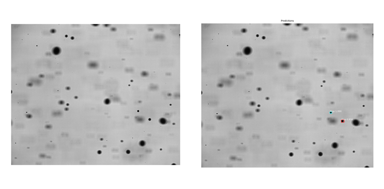

# ShadowMaster

## Overview

For the evaluation of droplet sizes from shadowgraph measurements we developed two methods. The first methods uses filtering and 'ordinary' image processing techniques to determine the droplet sizes. We started with the development of this code since we didn't had the budegt to buy a commercial code, couldn't find an opensource solution back then and were quite in a hurry to produce results. Over the years we improved the algorithm, however figured out that it was quite slow, and therefore though that droplet detection is a perfect fit for machine learning based pattern recognition. Both approaches can be found in this repository:

* [Python algorithm](#python-algorithm)
* [Neuronal network](#neuronal-network)

## Shadowgraphy

The shadowgraph imaging technique, or usually just called shadwowgraphy, is one way of a spray visualization. A shadowgraphy measurement setup consists essentially of a bright light source, a spray and a camera to record the images. In most cases also a magnifying lens/microscope is used, since the spray droplets may become pretty small. The bright light source creates a backlighting which is recorded by the camera. The spray is set in between the light and the camera and creates a shadow, due to the difference in refractive index between the liquid and the surrounding air. Therefore, the fluid appears as a dark object on the recording. 


Further information on the measurement technique can for example be found in the work of: 
- [R. Castrejon-Garcia, The shadowgraph imaging technique and its modern application
to fluid jets and drops](http://www.scielo.org.mx/pdf/rmf/v57n3/v57n3a16.pdf)

## Python Algorithm

This version to evaluate the shadowgraphy images is inspired by a classcical binary thresholding function, for which the python package
[@OpenCV](https://opencv-python-tutroals.readthedocs.io/en/latest/index.html) is used. Depending on the image quality it might be useful to substract the background image from the original recording to reduce the influence of scratches and dirt on the lens. Since there are ususally a lot of images recorded it is also possible to generate a background image as the mean value of a specific number of images. 


In the above picture the dropelt detection process is shown. The algorithmic steps are in general:

1. In a first step the [@cv2.fastNlMeansDenoising](https://opencv-python-tutroals.readthedocs.io/en/latest/py_tutorials/py_photo/py_non_local_means/py_non_local_means.html) filter is used to filter out local noise and then inverted. 
2. A binary image is then created by using a threshold function with a fixed threshold value. 
3. The resulting binary image is filtered for blurred droplets. Blured droplets are out of the focus layer with an unknown distance, and thus, cannot be correlated to a reference target in the focus layer. The distinction between sharp and unsharp drops is very difficult because there is no universal filter to filter out sharp objects. For this problem, a filter inspired by human vision was developed. For humans, an object appears sharp if there is a large colour difference between the edgevalue and the close environment. To simplify, the filter uses the difference between the center (usually the darkest point) and a radius increased by a few pixels. 
4. The [@„mh.labeled“](https://mahotas.readthedocs.io/en/latest/labeled.html) function is used to detect possible drops in the form of connected areas. For further filtering and to get more insight into the droplet shapes and formation, the contours in the filtered binary image are determined.
5. Not all detected objects are real droplets, which renders it necessary to filter out drops that are too small or too large. Even drops that are too strongly deformed can be easily filtered out via a maximum allowed aspect ratio of the expansion in x and y direction. The diameter of the detected drops is calculated as the equivalent circle diameter of the determined area. The final image shows the detected droplets in green. Correlating these circles with a know reference length recorded in the focus layer allows to derive the droplet diameters. In the following picture all steps are shown in an example image.

For each new measurement the settings for the filtering have to be adjusted manually (maximum difference, treshold value, ...). Even with a very good choice of these parameters it is somtimes cumbersome to process suboptimal recordings.


## Neuronal Network

A new approach to the analysis of Shadwowgraphy images represents a neural network. The structure of the network is the [@Mask R-CNN](https://arxiv.org/abs/1703.06870) network from 2017 by Kaiming He. The implementation of the network was done by [@matterport](https://github.com/matterport/Mask_RCNN), where a good introduction to the structure of the neural network can be found. This structure is adopted and only necessary changes were made. 

The Python script drops.py contains the necessary changes to the configuration of the neural network. The network ist trained based on the weights use for [@balloon](https://github.com/matterport/Mask_RCNN/tree/master/samples/balloon) detection with 60 training images and 20 validation images. There are three more scripts for evaluating a data set and the training process.

- The first (Master_drop_detection.py) allows the evaluation of shadowgraphy images. The neural network creates a bounding box and a mask for each possible drop. An exemplary result is shown in the following image. The diameter can be determined in two ways. Once as the average of the two sides of the bounding box or using the mask and the equivalent circle diameter. The detected drops can be filtered afterwards. A minimum and maximum allowed size in pixels can be specified. Furthermore, too strongly deformed/non-circular drops can be filtered out by the aspect ratio of the bounding box. Every detected drop gets a score, which indicates the probability of a drop. Depending on the quality of the images the minimum allowed score can be adjusted. 

- The second (Generate_new_training_dataset.py) allows the automatic generation of new training data with the result of the previous weight. These labelled images can be checked and improved by hand using the [@VGG Image Annonator](http://www.robots.ox.ac.uk/~vgg/software/via/).
- The third skript (Retrain.py) makes it possible to retrain the weights of the neuronal network with a new dataset.

In contrast to the above mentioned python version no manual adjustments are necessary. Only the subsequent filtering by deformation or drop size can be done additionally.

### Setup
We suggest to use an Anaconda environment, however you can aof course also use pip. To build the network, several python packages with specific versions are necessary. These are listed in the files "requirements.txt" for cpu and "requirements_gpu.txt" for the gpu version. 

The following commands are necessary to create the correct conda environment (ENV_NAME should be replaced by a name for the environment): 
```
conda create -n ENV_NAME
conda activate ENV_NAME
conda install --file requirements.txt
conda install -c conda-forge imgaug 
```

## License

## Authors
* Marla Hörmann
* Thorge Schweitzer
* Oliver Krüger
